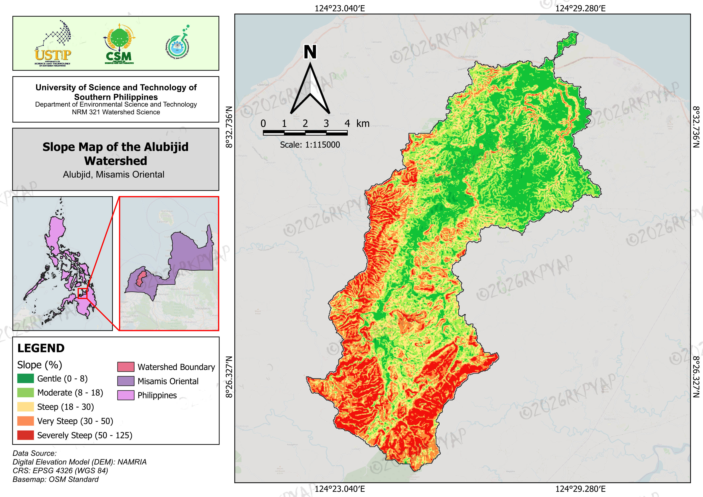
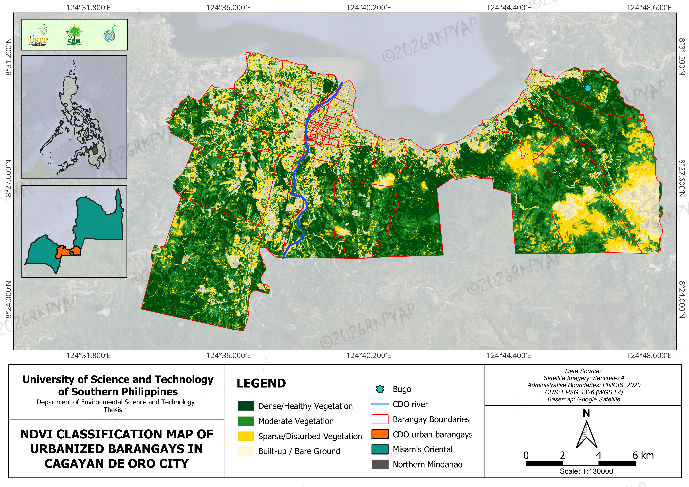
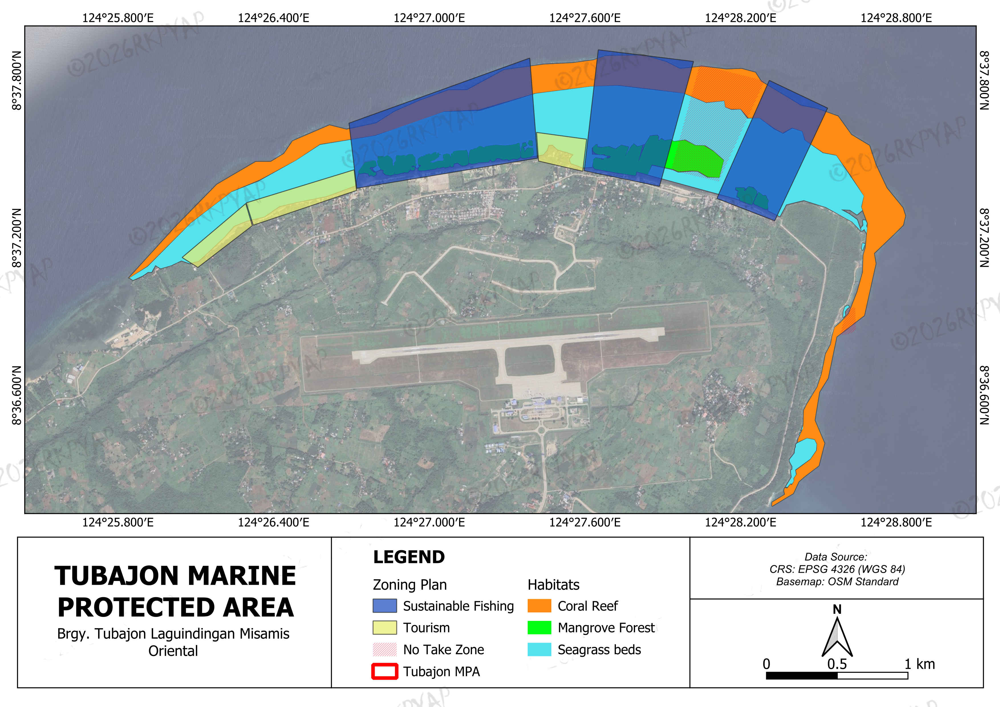

# Advanced GIS Analysis & Environmental Mapping

A professional portfolio of high-resolution environmental models, terrain analyses, and hazard susceptibility assessments. This repository demonstrates a rigorous approach to spatial data processing, translating complex topographical and remote sensing data into publication-ready cartographic layouts.

## Featured Spatial Analyses

### 1. Watershed & Topographical Modeling (Alubijid Watershed)
A comprehensive suite of hydrological and environmental models demonstrating advanced processing of Digital Elevation Models (DEM) and foundational spatial data.

* **Drainage Analysis:** Stream order classification and hydrological network extraction.
* **Terrain Modeling:** Slope categorization and land capability classification utilizing BSWM standards.
* **Risk Assessment:** Soil erosion modeling (RUSLE) and multi-criteria decision analysis (MCDA) for flood hazard susceptibility.
* **Infrastructure & Landcover:** Integration of OpenStreetMap (OSM) vectors and 2021 ESA WorldCover data.

.png)

### 2. Urban Environmental Monitoring (Cagayan de Oro City)
* **NDVI Classification:** Processed Sentinel-2A satellite imagery to classify vegetation density and identify sparse/disturbed environments across highly urbanized barangays.

### 3. Coastal Resource Management (Tubajon Marine Protected Area)
* **Zoning & Habitat Mapping:** High-resolution spatial planning delineating sustainable fishing zones, tourism sectors, no-take zones, and critical habitats (coral reefs, mangrove forests, seagrass beds).

## Technical Stack & Methodology

* **Spatial Analysis & Cartography:** QGIS
* **Remote Sensing Data Handling:** SRTM 30m DEM, Sentinel-2 Optical Imagery
* **Data Infrastructure:** OpenStreetMap (OSM), PostgreSQL / PostGIS 
* **Design & Layout:** Advanced cartographic styling, maintaining high visual hierarchy and strict data integrity for engineering and planning requirements.

## About the Author

I am a spatial data analyst and developer bridging the gap between complex geographic data systems and clear, actionable visualizations. My technical focus lies in environmental modeling, risk assessment, and ensuring high-fidelity outputs for professional planning requirements. 

Currently seeking freelance mapping projects and opportunities relating to spatial data analysis and software engineering.

**Contact:** [www.linkedin.com/in/richter-karol-yap-603052411] | [yaprichterkarol@gmail.com]
